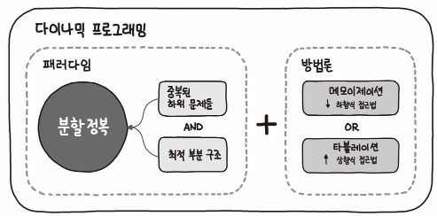

# 동적 계획법

## 개요

동적 계획법 (dynamic programming, DP), 최적화 이론의 한 기술이며, 특정 범위까지의 값을 구하기 위해서 그것과 다른 범위까지의 값을 이용하여 효율적으로 값을 구하는 알고리즘 설계 기법이다.

조금 장난스럽게 말해서 답을 재활용하는 거다. 앞에서 구했던 답을 뒤에서도 이용하고, 옆에서도 이용하고... 엄밀히 말해 동적 계획법은 구체적인 알고리즘이라기 보다는 문제해결 패러다임에 가깝다. 동적 계획법은 "어떤 문제를 풀기 위해 그 문제를 더 작은 문제의 연장선으로 생각하고, 과거에 구한 해를 활용하는" 방식의 알고리즘을 총칭한다.

답을 구하기 위해서 했던 계산을 또 하고 또 하고 계속해야 하는 종류의 문제의 구조를 최적 부분 구조 라고 부른다. 동적 계획법은 이런 문제에서 효과를 발휘한다.

동적 계획법을 영문으로는 다이나믹 프로그래밍(dynamic programming)이라 표기하는데, 이름과는 달리 딱히 다이나믹하지도 않고 프로그래밍이라는 단어와도 큰 연관이 없다. 이에 대해 이광근 교수의 저서 "컴퓨터 과학이 여는 세계"에서는 다이나믹 프로그래밍을 본질적인 의미를 더 살려서 기억하며 풀기로 더욱 적절하게 번역하였다.

## 구현

동적 계획법의 접근 방식은 기본적으로 분할 정복 알고리즘과 비슷하다. 위에서도 설명했지만 동적 계획법을 사용하는 알고리즘 역시 주어진 문제를 부분 문제로 나누어 각 부분 문제의 답을 계산하고, 이 계산한 결과값을 이용해 원래 문제의 답을 산출하기 때문이다. 여기서 분할정복과 차이가 생기는 부분은 원래의 문제를 부분 문제로 나누는 방식에 있다. 동적 계획법의 경우 주어진 문제를 나눌 때 부분 문제를 최대한 많이 이용하도록 나눈 다음, 주어진 부분 문제의 정답을 한 번만 계산하고 저장해둔 뒤 다시 한 번 이 부분 문제를 이용할 때에는 저장해둔 정답을 바로 산출하여 이용함으로써 속도를 향상시킨다.

즉, 동적 계획법은 그림과 같이 최적 부분 구조를 지닌 중복된 하위 문제들을 분할 정복으로 풀이하는 문제해결 패러다임이다.