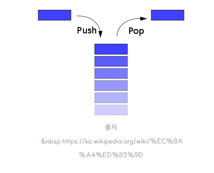

# 스택(Stack)

자료구조 중 하나로 후입선출(Last-In-First-Out, LIFO) 원칙에 따라 데이터를 저장하는 추상 자료형이다. 스택은 데이터를 저장하는 컨테이너로 데이터를 추가하거나 제거할 수 있다.

주요 연산을 살펴보면 다음과 같다.

1. push : 스택에 데이터를 추가하는 연산. 스택의 맨 위에 데이터를 삽입한다.
2. pop : 스택에서 데이터를 제거하는 연산. 스택의 맨 위에서 데이터를 삭제하고 반환한다.
3. peek 또는 top : 스택의 맨 위에 있는 데이터를 반환하지만, 스택에서 제거하지는 않는다.
4. isEmpty : 스택이 비어있는지 확인하는 연산이다.
5. size : 스택에 저장된 데이터의 개수를 반환한다.

## 스택(Stack)의 장점 및 단점

### 장점

1. 단순하고 간단한 구조 : 스택은 간단한 원칙에 따라 동작하는 자료구조로 구현이 비교적 쉽다. 데이터의 추가와 제거가 매우 빠르게 이뤄진다.
2. 메모리 관리 용이 : 스택은 정해진 크기의 메모리를 사용하므로 메모리 관리가 간단하다. 필요한 만큼의 공간만 사용하고 남는 공간이 없다.

### 단점

1. 크기 제한 : 스택은 정적인 크기를 가지고 있어 크기가 제한되어 있다. 크기를 초과해 데이터를 추가할 수 없는 경우에는 오버플로우(overflow)가 발생한다.
2. 중간 데이터 접근의 어려움 : 스택의 원칙에 따라 데이터는 맨 위에서만 추가되고 제거된다. 중간에 있는 데이터에 접근하거나 수정하기 위해서는 맨 위의 데이터들을 순차적으로 제거해야 한다. 중간 데이터에 빈번한 접근이 필요한 경우에는 스택은 효율적인 자료구조는 아니다.

## 레퍼런스

- http://hoehen-flug.tistory.com/30