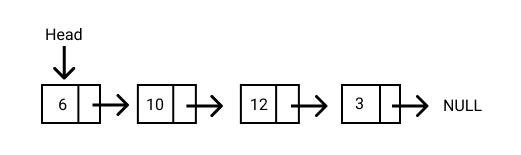

# 연결 리스트 (Linked List)

## 연결 리스트란?

연결 리스트는 선형적인 데이터 구조라는 점에서 배열과 유사합니다. 하지만 배열과 달리, 연결 리스트의 요소(elements)들은 특정 메모리 주소나 인덱스에 저장되지 않습니다. 오히려 각 요소는 포인터 또는 다음 객체에 대한 링크를 가지는 독립적인 객체에 가깝습니다.

연결 리스트의 각 요소를 노드(node)라 부릅니다. 노드는 일반적으로 데이터 그리고 다음 노드를 가리키는 링크, 이 2가지 아이템으로 구성됩니다. 참고로 데이터의 유형은 다양하게 올 수 있습니다. 아래 도표를 보겠습니다.



연결 리스트의 가장 첫 번째 지점을 헤드(head)라 부릅니다. 헤드는 연결 리스트의 첫 번째 노드를 의미합니다. 마지막 노드는 null을 가르킵니다. 만약 연결 리스트가 비어있는 경우, 헤드는 null을 참조하게 됩니다.

자바스크립트로 연결 리스트를 표현하자면 이렇게 표현할 수 있습니다.


```js
const list = {
    head: {
        value: 6,
        next: {
            value: 10,
            next: {
                value: 12,
                next: {
                    value: 3,
                    next: null
                }
            }
        }
    }
};
```

## 연결 리스트의 장점

- 연결 리스트는 데이터 구조의 큰 틀을 바꾸지 않고 노드를 추가하거나 삭제하기 쉽다는 장점이 있습니다. 이러한 점이 배열과 대비되는 점입니다.

## 연결 리스트의 단점

- 연결 리스트는 탐색이 느립니다. 배열과 달리, 연결 리스트는 데이터에 무작위 접근(random access)을 할 수 없기 때문입니다. 노드들은 첫 번째 노드부터 순차적으로만 접근해야 합니다.
- 연결 리스트는 배열보다 더 많은 메모리를 사용합니다. 왜냐하면 각 노드는 포인터를 담고 있기 때문입니다.

## 연결 리스트의 유형

영결 리스트는 크게 3가지 유형이 있습니다.

- 단일 연결 리스트(Singly Linked Lists) : 각 노드는 하나의 포인터만 가집니다. 우리가 위에서 이야기한 유형이 단일 연결 리스트입니다.
- 이중 연결 리스트(Doubly Linked Lists) : 각 노드는 2개의 포인터를 가지는데, 하나는 다음 노드를 그리고 나머지 하나는 이전 노드를 가르킵니다.
- 원형 연결 리스트(Circular Linked Lists) : 연결 리스트를 응용한 유형으로, 마지막 노드의 포인터가 첫 노드 또는 특정 노드를 가르키고 있는 마치 루프 형태를 가지는 유형을 말합니다.

## 레퍼런스

- https://www.freecodecamp.org/korean/news/implementing-a-linked-list-in-javascript/