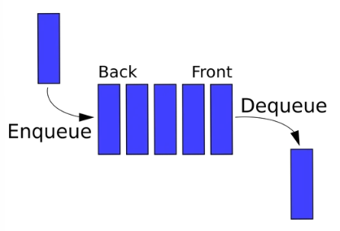

# 큐 (Queue)

## 개요

선입선출(First In First Out, FIFO)의 자료구조. 대기열이라고도 한다. Queue라고도 하는데, Queue라는 단어 자체가 표 같은 것을 구매하기 위해 줄서는 것을 의미한다.

스택과 비슷하지만 조금 다르다. 위에서도 나와있듯 '표를 사기 위해 줄을 서는 사람들'을 생각하면 된다.

데이터가 들어오는 위치는 가장 뒤(Rear 또는 Back이라고 한다.)에 있고, 데이터가 나가는 위치는 가장 앞(Front라고 한다.)에 있어서, 먼저 들어오는 데이터가 먼저 나가게 된다. 우선순위 큐, 원형 큐 등의 베리에이션이 존재한다. 입력 동작은 Enqueue, 출력 동작은 Dequeue라고 한다.

- Enqueue : 큐 맨 뒤에 요소 추가
- Dequeue : 큐 맨 앞쪽에 요소를 삭제
- Peek : Front에 위치한 데이터를 읽음
- Front : 큐의 맨 앞 위치(인덱스)
- Rear : 큐의 맨 뒤의 위치(인덱스)

## 레퍼런스

- https://namu.wiki/w/%ED%81%90(%EC%9E%90%EB%A3%8C%EA%B5%AC%EC%A1%B0)
