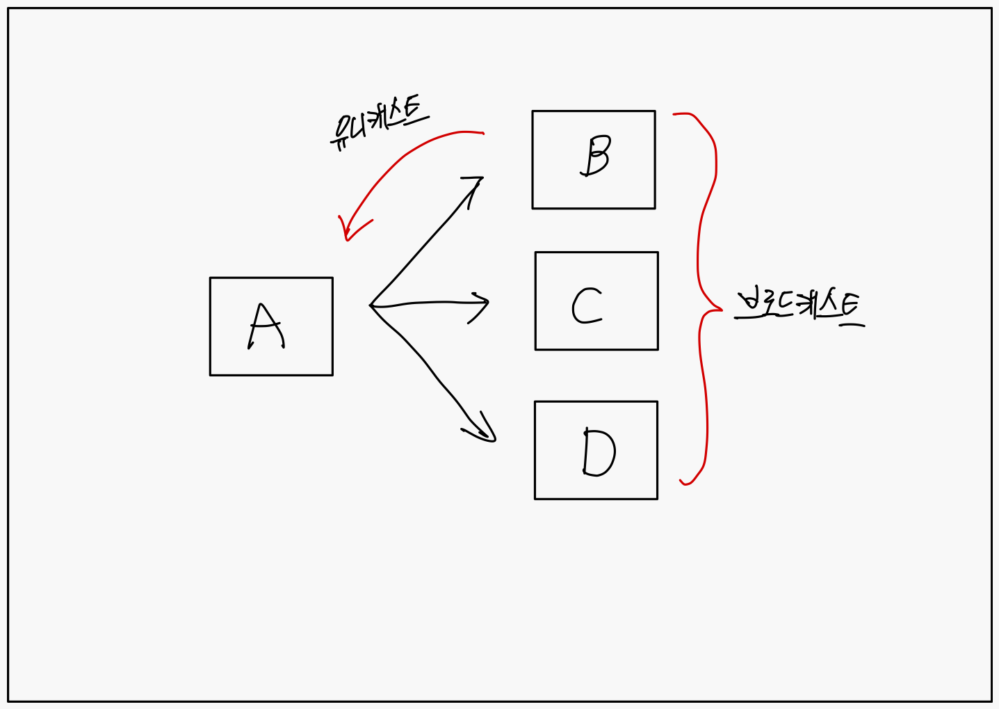

# ARP

컴퓨터와 컴퓨터 간의 통신은 흔히들 IP 주소 기반으로 통신한다고 알고 있지만 정확히 이야기하자면 IP 주소에서 ARP를 통해 MAC 주소를 찾아 MAC 주소를 기반으로 통신합니다.

ARP(Address Resolution Protocol)란 IP 주소로부터 MAC 주소를 구하는 IP와 MAC 주소의 다리 역할을 하는 프로토콜입니다.

ARP를 통해 가상 주소인 IP 주소를 실제 주소인 MAC 주소로 변환합니다. 이와 반대로 RARP를 통해 실제 주소인 MAC 주소를 가상 주소인 IP 주소로 변환하기도 합니다.

앞의 그림처럼 장치 A가 ARP Request 브로드캐스트를 보내서 IP 주소인 120.70.80.3에 해당하는 MAC 주소를 찾습니다. 그러고 나서 해당 주소에 맞는 장치 B가 ARP Reply 유니캐스트를 통해 MAC 주소를 반환하는 과정을 거쳐 IP 주소에 맞는 MAC 주소를 찾게 됩니다.

> **브로드캐스트**
>
> 송신 호스트가 전송한 데이터가 네트워크에 연결된 모든 호스트에 전송되는 방식

> **유니캐스트**
>
> 고유 주소로 식별된 하나의 네트워크 목적지에 1:1로 전송하는 방식