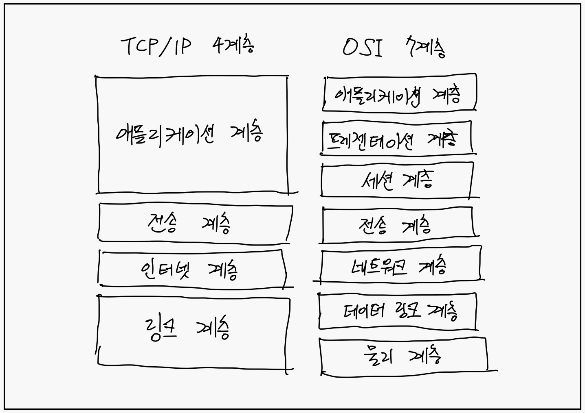
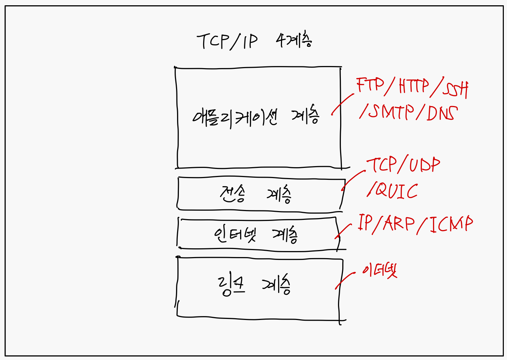

# 계층 구조

TCP/IP 계층은 네 개의 계층을 가지고 있으며 OSI 7계층과 많이 비교합니다.

위의 그림처럼 TCP/IP 계층과 달리 OSI 계층은 애플리케이션 계층을 세 개로 쪼개고 링크 계층을 데이터 링크 계층, 물리 계층으로 나눠서 표현하는 것이 다르며, 인터넷 계층을 네트워크 계층으로 부른다는 점이 다릅니다.

이 계층들은 특정 계층이 변경되었을 때 다른 계층이 영향을 받지 않도록 설계되었습니다. 예를 들어 전송 계층에서 TCP를 UDP로 변경했다고 해서 인터넷 웹 브라우저를 다시 설치해야 하는 것은 아니듯 유연하게 설계된 것이죠.,

각 계층을 대표하는 스택을 정리한 그림입니다.

## 애플리케이션 계층

애플리케이션(application) 계층은 FTP, HTTP, SSH, SMTP, DNS 등 응용 프로그램이 사용되는 프로토콜 계층이며 웹 서비스, 이메일 등 서비스를 실질적으로 사람들에게 제공하는 층입니다.

> **FTP**
>
> 장치와 장치 간의 파일을 전송하는 데 사용되는 표준 통신 프로토콜

> **SSH**
>
> 보안되지 않은 네트워크에서 네트워크 서비스를 안전하게 운영하기 위한 암호화 네트워크 프로토콜

> **HTTP**
>
> World Wide Web을 위한 데이터 통신의 기초이자 웹 사이트를 이용하는 데 쓰는 프로토콜

> **SMTP**
>
> 전자 메일 전송을 위한 인터넷 표준 통신 프로토콜

> **DNS**
>
> 도메인 이름과 IP 주소를 매핑해주는 서버

## 전송 계층

전송(transport) 계층은 송신자와 수신자를 연결하는 통신 서비스를 제공하며 연결 지향 데이터 스트림 지원, 신뢰성, 흐름 제어를 제공할 수 있으며 애플리케이션과 인터넷 계층 사이의 데이터가 전달될 때 중계 역할을 합니다. 대표적으로 TCP와 UDP가 있습니다.

TCP는 패킷 사이의 순서를 보장하고 연결지향 프로토콜을 사용해서 연결을 하여 신뢰성을 구축해서 수신 여부를 확인하며 '가상회선 패킷 교환 방식'을 사용합니다.

UDP는 순서를 보장하지 않고 수신 여부를 확인하지 않으며 단순히 데이터만 주는 '데이터그램 패킷 교환 방식'을 사용합니다.

### 가상회선 패킷 교환 방식

가상회선 패킷 교환 방식은 각 패킷에는 가상회선 식별자가 포함되며 모든 패킷을 전송하면 가상회선이 해제되고 패킷들은 전송된 '순서대로' 도착하는 방식을 말합니다.

### 데이터그램 패킷 교환 방식

데이터그램 패킷 교환 방식이란 패킷이 독립적으로 이동하며 최적의 경로를 선택하여 가는데, 하나의 메시지에서 분할된 여러 패킷은 서로 다른 경로로 전송될 수 있으며 도착한 '순서가 다를 수' 있는 방식을 뜻합니다.

### TCP 연결 성립 과정

TCP는 신뢰성을 확보할 때 '3-웨이 핸드셰이크(3-way handshake)'라는 작업을 진행합니다.