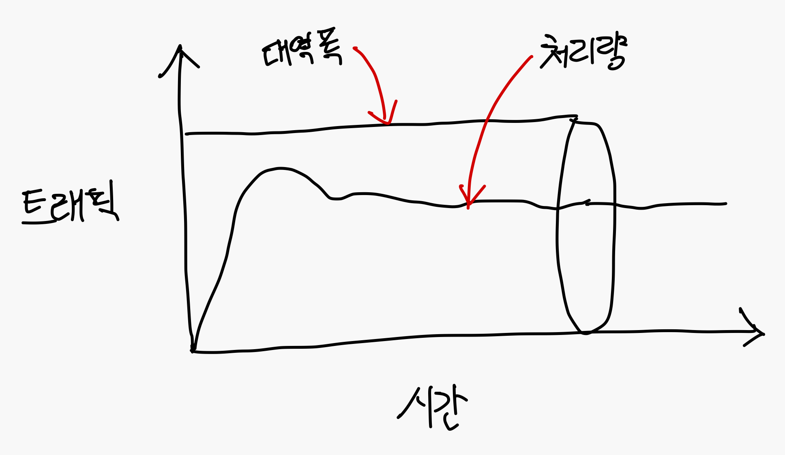

# 처리량과 지연 시간

네트워크를 구축할 때는 '좋은' 네트워크로 만드는 것이 중요합니다. 좋은 네트워크란 많은 처리량을 처리할 수 있으며 지연 시간이 짧고 장애 빈도가 적으며 좋은 보안을 갖춘 네트워크를 말합니다.

## 처리량

처리량(throughput)은 링크 내에서 성공적으로 전달된 데이터의 양을 말하며 보통 얼만큼의 트래픽을 처리했는지를 나타냅니다. '많은 트래픽을 처리한다 = 많은 처리량을 가진다'라는 의미입니다.

단위로는 bps(bits per second)를 씁니다. 초당 전송 또는 수신되는 비트 수라는 의미입니다. 처리량은 사용자들이 많이 접속할 때마다 커지는 트래픽, 네트워크 장치 간의 대역폭, 네트워크 중간에 발생하는 에러, 장치의 하드웨어 스펙에 영향을 받습니다.

앞의 그림을 보면 트래픽이 있는데 트래픽은 특정 시점에 링크 내에 '흐르는' 데이터의 양을 말합니다. 예를 들어 서버에 저장된 파일(문서, 이미지, 동영상 등)을 클라이언트(사용자)가 다운로드할 때 발생되는 데이터의 누적량을 뜻합니다. 트래픽과 처리량을 헷갈릴 수 있는데 다음처럼 이해하면 됩니다.

- 트래픽이 많아졌다. = 흐르는 데이터가 많아졌다.
- 처리량이 많아졌다. = 처리되는 트래픽이 많아졌다.

> **대역폭**
>
> 주어진 시간 동안 네트워크 연결을 통해 흐를 수 있는 최대 비트 수

## 지연 시간

지연 시간(latency)이란 요청이 처리되는 시간을 말하며 어떤 메시지가 두 장치 사이를 왕복하는 데 걸린 시간을 말합니다.

지연 시간은 매체 타입(무선, 유선), 패킷 크기, 라우터의 패킷 처리 시간에 영향을 받습니다.