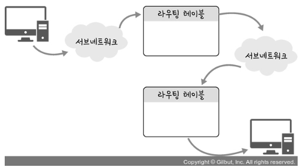
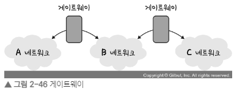
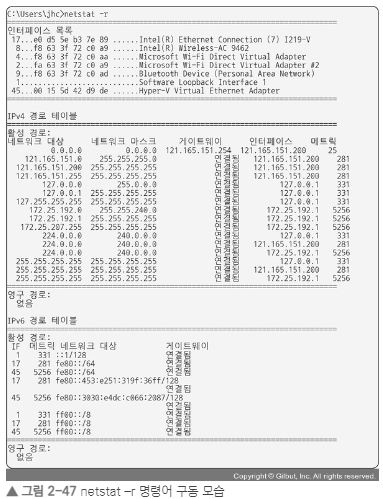

# 홉바이홉 통신

IP 주소를 통해 통신하는 과정을 홉바이홉 통신이라고 합니다. 여기서 홉(hop)이란 영어 뜻 자체로는 건너뛰는 모습을 의미합니다. 이는 통신망에서 각 패킷이 여러 개의 라우터를 건너가는 모습을 비유적으로 표현한 것입니다. 다음 그림처럼 수많은 서브네트워크 안에 있는 라우터의 라우팅 테이블 IP를 기반으로 패킷을 전달하고 또 전달해나가며 라우팅을 수행하며 최종 목적지까지 패킷을 전달합니다.

즉, 통신 장치에 있는 '라우팅 테이블'의 IP를 통해 시작 주소부터 시작하여 다음 IP로 계속해서 이동하는 '라우팅' 과정을 거쳐 패킷이 최종 목적지까지 도달하는 통신을 말합니다.

## 라우팅 테이블

라우팅 테이블(routing table)은 송신지에서 수신지까지 도달하기 위해 사용되며 라우터에 들어가 있는 목적지 정보들과 그 목적지로 가기 위한 방법이 들어 있는 리스트를 뜻합니다. 라우팅 테이블에는 게이트웨이와 모든 목적지에 대해 해당 목적지에 도달하기 위해 거쳐야 할 다음 라우터의 정보를 가지고 있습니다.

## 게이트웨이

게이트웨이(gateway)는 서로 다른 통신망, 프로토콜을 사용하는 네트워크 간의 통신을 가능하게 하는 관문 역할을 하는 컴퓨터나 스프트웨어를 두루 일컫는 용어입니다.

사용자는 인터넷에 접속하기 위해 수많은 톨게이트인 게이트웨이를 거쳐야 하며 게이트웨이는 서로 다른 네트워크상의 통신 프로토콜을 변환해주는 역할을 하기도 합니다.

게이트웨이를 확인하는 방법은 라우팅 테이블을 통해 볼 수 있으며 라우팅 테이블은 윈도우의 명령 프롬프트에서 netstat -r 명령어를 실행하여 확인할 수 있습니다.

위의 그림처럼 IPv4 경로 테이블, IPv6 경로 테이블이 있는데 이것이 바로 라우팅 테이블이며 게이트웨이, 인터페이스 등이 나오는 것을 볼 수 있습니다.