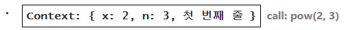
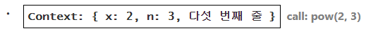
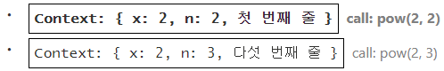
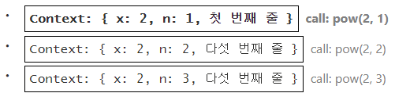
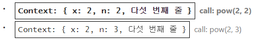

# 실행 컨텍스트 (Execution Context)

실행 컨텍스트는 함수 실행에 대한 세부 정보를 담고 있는 내부 데이터 구조입니다. 제어 흐름의 현재 위치, 변수의 현재 값, `this`의 값 등 상세 내부 정보가 실행 컨텍스트에 저장됩니다.

함수 호출 일 회당 정확히 하나의 실행 컨텍스트가 생성됩니다.

함수 내부에 중첩 호출이 있을 때는 아래와 같은 절차가 수행됩니다.

- 현재 함수의 실행이 일시 중지됩니다.
- 중지된 함수와 연관된 실행 컨텍스트는 실행 컨텍스트 스택(Execution Context Stack) 이라는 특별한 자료 구조에 저장됩니다.
- 중첩 호출이 실행됩니다.
- 중첩 호출 실행이 끝난 이후 실행 컨텍스트 스택에서 일시 중단한 함수의 실행 컨텍스트를 꺼내오고, 중단한 함수의 실행을 다시 이어갑니다.

```js
function pow(x, n) {
  if (n == 1) {
    return x;
  } else {
    return x * pow(x, n - 1);
  }
}

alert( pow(2, 3) ); // 8
```

이제 `pow(2, 3)`가 호출되면 실행 컨텍스트에서 무슨 일이 일어나는지 살펴봅시다.

## pow(2, 3)

`pow(2, 3)`를 호출하는 순간, 실행 컨텍스트엔 변수 `x = 2, n = 3`이 저장되고, 실행 흐름은 함수의 첫 번째 줄에 위치합니다.

이를 도식화 하면 다음과 같습니다.



위 그림은 함수 실행이 시작되는 순간을 나타낸 것입니다. 지금 상태론 조건 `n == 1`을 만족하지 못하므로 실행 흐름은 `if`의 두 번째 분기로 넘어갑니다.

변수는 동일하지만, 실행 흐름의 위치가 변경되면서 실행 컨텍스트도 다음과 같이 변경됩니다.



`x * pow(x, n - 1)`을 계산하려면 새로운 인수가 들어가는 `pow`의 서브 호출(subcall), `pow(2, 2)`을 만들어야 합니다.

## pow(2, 2)

중첩 호출을 하기 위해, 자바스크립트는 실행 컨텍스트 스택에 현재 실행 컨텍스트를 저장합니다.

지금 보고 있는 예시에선 실행 컨텍스트 스택에 동일한 함수 `pow`를 호출하였는데, 이는 중요치 않습니다. 모든 함수에 대해 아래 프로세스가 똑같이 적용됩니다.

1. 스택 최상단에 현재 컨텍스트가 '기록'됩니다.
2. 서브 호출을 위한 새로운 컨텍스트가 만들어집니다.
3. 서브 호출이 완료되면 기존 컨텍스트를 스택에서 꺼내(pop) 실행을 이어나갑니다.

다음은 서브 호출 `pow(2, 2)`이 시작될 때의 실행 컨텍스트 스택입니다.



굵은 테두리로 표시한 새 실행 컨텍스트는 상단에, 기존 컨텍스트는 하단에 있습니다.

이전 컨텍스트에 변수 정보, 코드가 일시 중단된 줄에 대한 정보가 저장되어있기 때문에 서브 호출이 끝났을 때 이전 컨텍스트가 문제없이 다시 시작됩니다.

> **주의:**
>
> 예시엔 한 줄에 서브 호출 하나만 있기 때문에, 그림에서 '줄'이라는 단어를 사용했습니다. 하지만 한 줄에는 `pow(...) + pow(...) + somethingElse(...)` 같이 복수의 서브 호출이 있을 수 있습니다.
> 따라서 좀 더 정확히는 실행이 '서브 호출 바로 직후'에 시작된다고 이야기 할 수 있습니다.

## pow(2, 1)

동일한 과정이 다시 반복됩니다. 다섯 번째 줄에서 인수 `x = 2`, `n = 1`과 함께 새로운 서브 호출이 만들어집니다.

새로운 실행 컨텍스트가 만들어지고, 이전 실행 컨텍스트는 스택 최상단에 올라갑니다(push).



기존 컨텍스트 두 개가 밑에, `pow(2, 1)`에 상응하는 컨텍스트가 맨 위에 있는 것을 확인할 수 있습니다.

## 실행 종료

`pow(2, 1)`가 실행될 땐 상황이 달라집이다. 이전과는 달리 조건 `n ==1`을 만족시키므로 `if`문의 첫 번째 분기가 실행됩니다.

이젠 호출해야 할 중첩 호출이 없습니다. 따라서 함수는 종료되고 `2`가 반환됩니다.

함수는 종료되었기 때문에 이에 상응하는 실행 컨텍스트는 쓸모가 없어졌습니다. 따라서 해당 실행 컨텍스트는 메모리에서 삭제됩니다. 스택 맨 위엔 이전의 실행 컨텍스트가 위치하게 됩니다.



마지막 실행 컨텍스트까지 처리되면 `pow(2, 3) = 8` 이라는 결과가 반환됩니다.

지금 보신 예시의 재귀 깊이는 **3** 입니다.

도식을 통해 살펴보았듯이, 재귀 깊이는 스택에 들어가는 실행 컨텍스트 수의 최댓값과 같습니다.

실행 컨텍스트는 메모리를 차지하므로 재귀를 사용할 땐 메모리 요구사항에 유의해야 합니다. `n`을 늘리면 `n`이 줄어들 때마다 만들어지는 `n`개의 실행 컨텍스트가 저장될 메모리 공간이 필요하기 때문입니다.