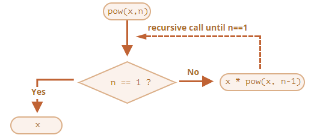

# 재귀

재귀는 큰 목표 작업 하나를 동일하면서 간단한 작업 여러 개로 나눌 수 있을 때 유용한 프로그래밍 패턴입니다. 목표 작업을 간단한 동작 하나와 목표 작업을 변형한 작업으로 단순화시킬 수 있을 때도 재귀를 사용할 수 있습니다. 곧 살펴보겠지만, 특정 자료구조를 다뤄야 할 때도 재귀가 사용됩니다.

문제 해결을 하다 보면 함수에서 다른 함수를 호출해야 할 때가 있습니다. 이때 함수가 자기 자신을 호출할 수도 있는데, 이를 재귀라고 부릅니다.

## 두 가지 사고방식

간단한 예시를 시작으로 재귀에 대해 알아보겠습니다. `x`를 `n` 제곱해 주는 함수 `pow(x, n)`를 만들어봅시다. `pow(x, n)`는 `x`를 `n`번 곱해주기 때문에 아래 결과를 만족해야 합니다.

```js
pow(2, 2) = 4
pow(2, 3) = 8
pow(2, 4) = 16
```

구현하는 방법은 두 가지가 있습니다.

1. 반복적인 사고를 통한 방법: `for` 루프

```js
function pow(x, n) {
  let result = 1;

  // 반복문을 돌면서 x를 n번 곱함
  for (let i = 0; i < n; i++) {
    result *= x;
  }

  return result;
}

alert( pow(2, 3) ); // 8
```

2. 재귀적인 사고를 통한 방법: 작업을 단순화하고 자기 자신을 호출

```js
function pow(x, n) {
  if (n == 1) {
    return x;
  } else {
    return x * pow(x, n - 1);
  }
}

alert( pow(2, 3) ); // 8
```

재귀를 이용한 예시가 반복문을 사용한 예시와 어떤 부분에서 근본적인 차이가 있는지 유심히 살펴보시기 바랍니다.

`pow(x, n)`을 호출하면 아래와 같이 두 갈래로 나뉘어 코드가 실행됩니다.

```js
              if n==1  = x
             /
pow(x, n) =
             \
              else     = x * pow(x, n - 1)
```

1. `n == 1`일 때: 모든 절차가 간단해집니다. 명확한 결괏값을 즉시 도출하므로 이를 재귀의 베이스(base)라고 합니다. `pow(x, 1)`는 `x`입니다.
2. `n == 1`이 아닐 때: `pow(x, n)`은 `x * pow(x, n - 1)`으로 표현할 수 있습니다. 이를 재귀 단계(recursive step) 라고 부릅니다. 여기선 목표 작업 `pow(x, n)`을 간단한 동작(`x`를 곱하기)과 목표 작업을 변형한 작업(`pow(x, n - 1)`)으로 분할하였습니다. 재귀 단계는 `n`이 `1`이 될 때까지 계속 이어집니다.

즉, `pow`는 `n == 1`이 될 때까지 재귀적으로 자신을 호출합니다.



`pow(2, 4)`를 계산하려면 아래와 같은 재귀 단계가 차례대로 이어집니다.

1. `pow(2, 4) = 2 * pow(2, 3)`
2. `pow(2, 3) = 2 * pow(2, 2)`
3. `pow(2, 2) = 2 * pow(2, 1)`
4. `pow(2, 1) = 2`

이렇게 재귀를 이용하면 함수 호출의 결과가 명확해질 때까지 함수 호출을 더 간단한 함수 호출로 계속 줄일 수 있습니다.

가장 처음 하는 호출을 포함한 중첩 호출의 최대 개수는 재귀 깊이(recursion depth)라고 합니다. `pow(x, n)`의 재귀 깊이는 `n`입니다.

자바스크립트 엔진은 최대 재귀 깊이를 제한합니다. 만개 정도까진 확실히 허용하고, 엔진에 따라 이보다 더 많은 깊이를 허용하는 경우도 있습니다. 하지만 대다수의 엔진이 십만까지는 다루지 못합니다. 이런 제한을 완화하려고 엔진 내부에서 자동으로 `tail calls optimization`라는 최적화를 수행하긴 하지만, 모든 곳에 적용되는 것은 아니고 간단한 경우에만 적용됩니다.

재귀 깊이 제한 때문에 재귀를 실제 적용하는 데 제약이 있긴 하지만, 재귀는 여전히 광범위하게 사용되고 있습니다. 재귀를 사용하면, 간결하고 유지보수가 쉬운 코드를 만들 수 있기 때문입니다.