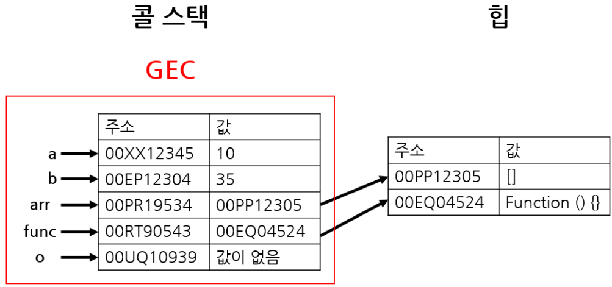
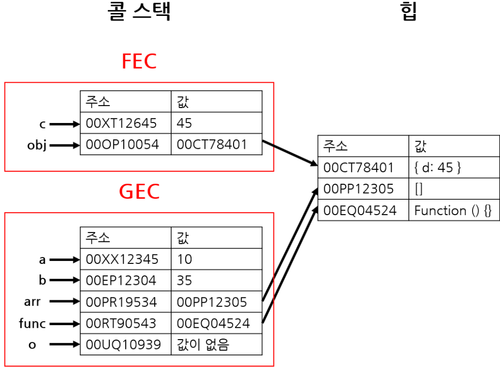
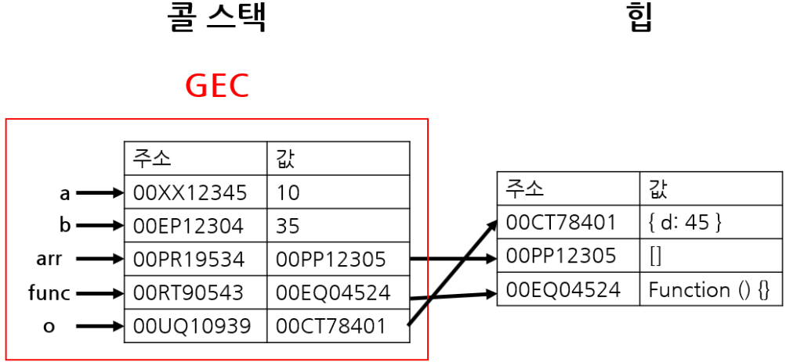

# 콜 스택과 메모리 힙

## 콜 스택, 메모리 힙이란?

자바스크립트 엔진은 메모리 힙과 콜 스택으로 구성되어 있습니다. 가장 유명한 것이 구글의 V8 Engine입니다. 자바스크립트는 단일 스레드 (single thread) 프로그래밍 언어인데, 이 의미는 Call Stack이 하나 라는 이야기입니다. 즉 멀티가 되지 않고, 하나씩 하나씩 처리한다는 의미입니다.

## 콜 스택(Call Stack)

원시타입 값과 함수 호출의 실행 컨텍스트를 저장하는 곳입니다.

## 메모리 힙(Memory Heap)

객체, 배열, 함수와 같이 크기가 동적으로 변할 수 있는 참조타입 값을 저장하는 곳입니다.

## 예시를 통한 동작 원리 보기

```js
let a = 10;
let b = 35;
let arr = [];
function func() {
  const c = a + b;
  const obj = { d: c };
  return obj;
}
let o = func();
```

위 코드로 콜 스택과 힙의 동작을 보면 다음과 같습니다.

제일 처음, GEC(Global Execution Context)가 생성되고 원시 값은 콜 스택에, 참조 값은 힙에 저장됩니다.



그 다음 함수 `func()`을 실행하게 되고 새로운 FEC(Function Execution Context)가 생성되며 동일하게 원시 값은 스택에, 참조 값은 힙에 저장됩니다.



이후, 함수 `func()` 이 객체 `obj`를 리턴해서 `o`에 저장됩니다. 리턴하기 때문에 FEC는 콜 스택에서 제거됩니다.



전체 코드가 실행이 끝나고 GEC가 콜 스택에서 제거됩니다. GEC가 제거됨에 따라서, 힙의 객체를 참조하는 스택의 값이 없기 때문에 가비지 컬렉터(Garbage Collector, GC)에 의해 제거됩니다.