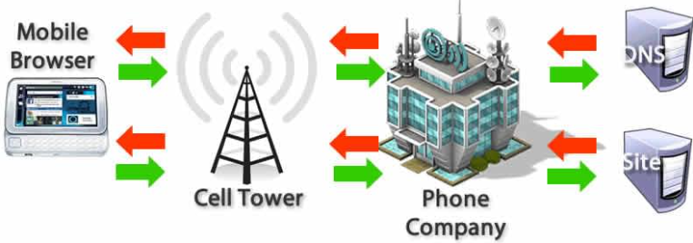
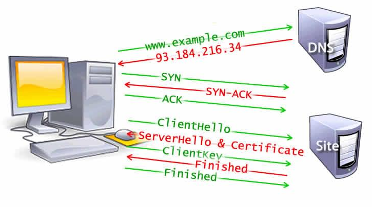

# 브라우저 동작 원리

사용자는 로드가 빠르고 상호작용이 원활한 컨텐츠로 이루어진 웹 경험을 원합니다. 따라서 개발자는 이 두 가지 목표를 달성하기 위해서 부단히 노력해야 합니다.

실제 성능 및 체감되는 성능을 향상시키는 방법을 이해하기 위해서 브라우저가 어떻게 동작하는지 이해하는것이 도움이 됩니다.

## 개요

빠른 사이트는 더 좋은 사용자 경험을 제공합니다. 사용자는 로드가 빠르고 상호작용이 원활한 컨텐츠로 이루어진 웹 경험을 원합니다.

웹 성능에 있어서 두 가지 주요한 문제는 지연시간과 브라우저가 대부분 싱글 쓰레드로 동작한다는 점입니다.

빠른 로딩을 하는데 있어서 지연시간은 이겨내야할 중요한 문제입니다. 빠른 로딩을 위해 신경써야할 것에는 최대한 빠르게 요청하는 것(적어도 체감 상 매우 빠른 수준으로 보내기)도 포함됩니다. 네트워크 지연시간은 네트워크를 통해 컴퓨터로 바이트를 전송하는데 걸리는 시간을 의미합니다. 웹 최적화는 페이지 로드가 최대한 빠르게 이루어 질 수 있도록 하는 것입니다.

대부분 브라우저는 싱글 쓰레드입니다. 원활한 상호작용을 위한 개발자의 목표는 부드러운 스크롤부터 매우 기민하게 반응하는 터치에 이르기까지 성능이 뛰어난 상호 작용을 보장하는 것입니다. 메인 쓰레드가 요청된 모든 작업을 수행하면서도 유저와의 상호작용에 반응 할 수 있도록 보장하기 위해서는 렌더링 시간이 가장 중요합니다. 브라우저가 싱글 쓰레드로 동작한다는 점을 이해하고 가능한 메인 쓰레드의 책임을 줄여주는 방식으로 웹 성능 향상을 이룰 수 있습니다. 이렇게 하면 렌더링은 부드럽고 상호작용에 대한 응답은 즉각적일 것입니다.

## 탐색(Navigation)

탐색은 웹페이지를 로딩하는 첫 단계입니다. 사용자가 주소창에 URL을 입력하거나, 링크를 클릭하고, 폼(form)을 제출하는 등의 동작을 통해 요청을 보낼 때마다 발생합니다.

웹 최적화의 목표 중 하나는 탐색이 완료될 때까지의 시간을 최소화 하는 것입니다. 이상적인 조건에서 그다지 오래 걸리는 작업이 아니지만 지연시간과 대역폭은 지연을 일으키는 적입니다.

### DNS 조회(DNS Lookup)

웹 페이지를 탐색하는 첫 단계는 해당 페이지의 자원이 어디에 위치하는지 찾는 것입니다. 만약 `https://example.com`을 탐색한다면 HTML 페이지는 IP 주소가 `93.184.216.34`인 서버에 위치하고 있습니다. 만약 이 사이트를 한 번도 방문한 적이 없다면 DNS 조회가 필요합니다.

브라우저는 DNS 조회를 요청합니다. 이는 최종적으로 이름 서버에 의해서 처리되고, IP 주소로 응답합니다. 최초의 요청 이후에, IP는 일정 기간 동안 캐시됩니다. 이름 서버에 다시 연락하는 대신 캐시에서 IP 주소를 검색하여 후속 요청 속도를 높입니다.

DNS 조회는 보통 호스트 이름 하나당 한 번만 수행됩니다. 하지만 DNS 조회는 요청된 페이지에서 참조하는 다른 호스트 이름에 대해서는 각각 수행해야합니다. 만약 글꼴, 이미지, 스크립트, 광고 드리고 다른 자원들이 서로 다른 호스트 이름을 가지고 있다면, DNS 조회는 각각에 대해서 모두 수행되어야 합니다.



이는 특히 모바일 네트워크 환경에서 성능에 문제가 될 수 있습니다. 사용자가 모바일 환경에 있을 때, 각각의 DNS 조회는 휴대폰에서 셀 타워에 가야하고, 셀 타워에서 권위 있는 DNS 서버에 도달해야합니다. 휴대폰과 셀 타워, 그리고 이름 서버의 거리에 따라서 상당한 지연시간이 생길 수도 있습니다.

### TCP 핸드셰이크(TCP Handshake)

IP 주소를 알고난 후에는, 브라우저는 서버와 TCP 3방향 핸드셰이크를 통해 연결을 설정합니다. 이 방식은 데이터를 전송하기 전에 (주로 HTTPS를 통해서) 통신하려는 두 주체 (이 경우에는 브라우저와 웹 서버)가 TCP 소켓 연결을 위한 매개변수를 주고 받을 수 있도록 만들어졌습니다.

TCP의 3방향 핸드셰이크 기술을 "SYN-SYN-ACK" (더 정확히는 SYN, SYN-ACK, ACK)로 불리기도 합니다. 두 컴퓨터 간 TCP 세션을 협상하고 시작하기 위해서 TCP가 3개의 메세지를 전달하기 때문입니다. 이는 요청이 보내지기 전에 3개의 추가적인 메세지가 컴퓨터 사이에 주고받아진다는 의미입니다.

### TLS 협상(TLS Negotiation)

HTTPS를 이용한 보안성있는 연결을 위해서는 또 다른 "핸드셰이크"가 필요합니다. (TLS 협상이라고 할 수 있는) 이 핸드셰이크는 통신 암호화에 쓰일 암호를 결정하고, 서버를 확인하고, 실제 데이터 전송 전에 안전한 연결이 이루어지도록 합니다. 이를 위해서 자원에 대한 실제 요청 전에 클라이언트에서 서버로 3번 더 왕복해야합니다.



연결에 보안성을 더하는 것은 페이지 로딩을 더디게 합니다. 하지만 보안성있는 연결은 지연시간이라는 비용을 낼만큼 충분한 가치가 있습니다. 브라우저와 웹서버 사이에 전송되는 데이터가 제 3자에 의해서 해독될 수 없게 되기 때문입니다.

8번의 왕복이 있은 후에, 브라우저는 마침내 요청을 할 수 있습니다.

## 응답(Response)

웹서버로 한 번 연결이 성립되고 나면, 브라우저는 유저 대신에 초기 `HTTP GET request`를 보냅니다. 웹사이트는 대게 HTML 파일을 요청합니다. 서버가 요청을 받으면, 관련 응답 해더와 함께 HTML의 내용을 응답하게 됩니다.

```html
<!doctype html>
<html>
  <head>
    <meta charset="UTF-8" />
    <title>My simple page</title>
    <link rel="stylesheet" src="styles.css" />
    <script src="myscript.js"></script>
  </head>
  <body>
    <h1 class="heading">My Page</h1>
    <p>A paragraph with a <a href="https://example.com/about">link</a></p>
    <div>
      
    </div>
    <script src="anotherscript.js"></script>
  </body>
</html>
```

이 초기 요청에 대한 응답은 수신된 첫 바이트 데이터를 포함하고 있습니다. Time to First Byte (TTFB)는 사용자가 (링크를 클릭하는 등의 방식으로) 요청을 보내고 HTML의 첫 패킷을 받는데 걸린 시간입니다. 첫 번째 컨텐츠 청크는 일반적으로 14kb 크기의 데이터입니다.

위 예제에서, 요청은 확실히 14kb보다 작습니다. 하지만 아래에서 설명하는 것처럼 구문 분석되는 중에 브라우저가 링크를 만날 때까지 링크가 걸린 자원들은 요청되지 않습니다.

### TCP 슬로우 스타트 (TCP Slow Start) / 14kb rule

첫 응답 패킷은 14kb입니다. 이는 네트워크 통신의 속도를 조절하는 알고리즘인 TCP 슬로우 스타트에 의해 정해진 것입니다. 슬로우 스타트는 네트워크의 최대 대역폭을 파악할 수 있을 때까지 점진적으로 데이터의 전송량을 증가시킵니다.

TCP 슬로우 스타트 방식에 따라, 첫 패킷을 받고난 이후에 서버는 다음 패킷의 사이즈를 두 배인 28kb로 늘립니다. 뒤 이은 패킷의 크기도 미리 정의한 임계치에 다다르거나, 혼잡의 징후가 나타나기 전까지 2배씩 커집니다.

### 혼잡 제어(Congestion Control)

서버가 TCP 패킷으로 데이터를 보내면서, 사용자의 클라이언트는 확인 응답(acknowledgements, ACKs)을 보내면서 데이터의 수신을 확인해줍니다. 연결은 하드웨어나 네트워크 상태에 따라서 제한된 용량만을 가지고 있습니다. 연결은 하드웨어나 네트워크 상태에 따라서 제한된 용량만을 가지고 있습니다. 만약 서버가 패킷을 너무 빠르게 보내게 되면, 그 패킷들은 무시될 것입니다. 즉 확인 응답이 없을 것입니다. 서버는 이를 누락된 확인 응답으로 파악합니다. 혼잡 제어 알고리즘은 보내진 패킷의 흐름과 확인 응답을 바탕으로 전송 속도를 결정합니다.